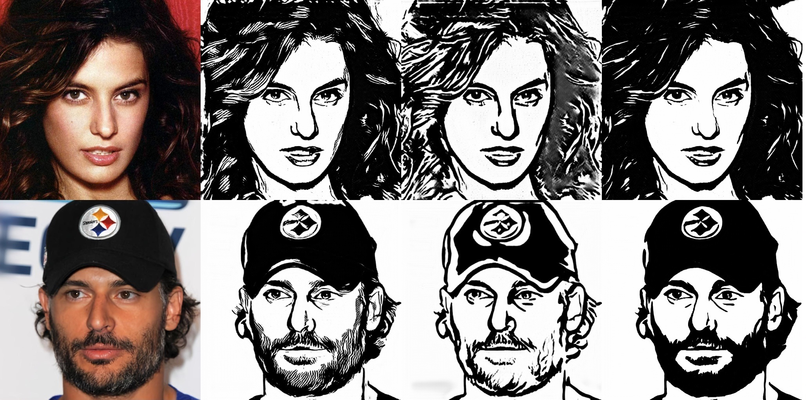

# Video2Drawing

**Stylizer Video to Drawing. Based on "Unpaired-Portrait-Drawing" repository.**

**Check how it works on Google Colab:**
- Russian Language .ipynb)
- Bad English Translation .ipynb)

*If there are errors, you can find a solution [HERE](https://youtu.be/j9Yq6t4hUeA)*

**Based on:** [Unpaired-Portrait-Drawing](https://github.com/yiranran/Unpaired-Portrait-Drawing)

This project generates artistic portrait drawings from face video frames using a GAN-based model.

**Result Example:**

